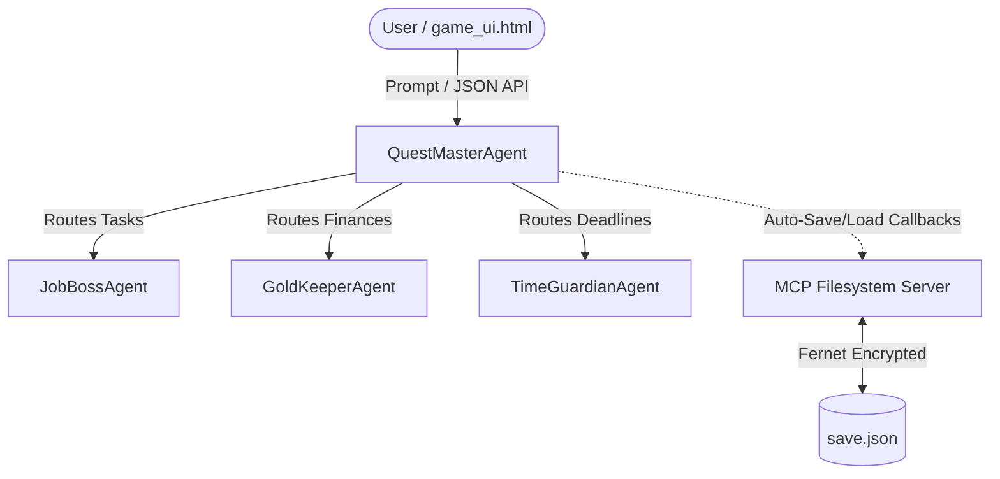

# LifeQuest: An RPG-Style Personal Life Management Multi-Agent System
> *Gamifying career search, scheduling, and budgeting with a secure, multi-agent AI assistant.*
> 
> *   **Live Frontend UI**: [https://my-lifequest-app.web.app](https://my-lifequest-app.web.app)
> *   **Live Backend API**: [https://temp-lifequest-213291527780.us-east1.run.app](https://temp-lifequest-213291527780.us-east1.run.app)

## 1. Problem Statement
International students and early-career professionals face a highly complex set of stressors: managing visa and university deadlines, keeping track of tight personal budgets, and executing job application strategies. Each of these domains is critical, yet tracking them across separate spreadsheets and tools is overwhelming. When these stressors overlap—such as a major visa deadline coinciding with a low financial budget—stress compounds. There is a need for a unified, engaging, and secure assistant that can coordinate across these domains, highlight overlapping urgencies, and safeguard sensitive personal data.

## 2. Solution Overview
**LifeQuest** gamifies personal management into an RPG. The user acts as the player, whose life metrics are represented as **HP** (vitality/stress), **Gold** (financial health), **XP** (career progress), and **Quest Log** (active tasks). By wrapping real tasks (deadlines, budget transactions, job hunt activities) in RPG concepts, the system makes personal management engaging.

## 3. Architecture & Information Flow
LifeQuest is built as a hierarchical multi-agent system:
*   **QuestMasterAgent (`root_agent`)**: The central hub. It maintains the global RPG state (`hp`, `gold`, `xp`, `quest_log`, `budget`, `deadlines`), handles user queries, routes tasks to specialized sub-agents, and runs **Compound Event Detection** (detecting overlapping stressors like a low budget and tight deadline to generate a unified, coordinated "Dual-Quest" warning).
*   **JobBossAgent (`job_boss_agent`)**: Handles job descriptions to return "boss intel" (fit score, interview prep tips) and awards XP upon completion.
*   **GoldKeeperAgent (`gold_keeper_agent`)**: Accepts financial transaction entries, updates the gold balance (1 USD = 1 Gold Point), adjusts the monthly budget, and issues low-gold HP penalties.
*   **TimeGuardianAgent (`time_guardian_agent`)**: Manages deadlines tagged with the month (format `"YYYY-MM"`), detects calendar conflicts, and filters deadlines by month.



## 4. Demonstration of Course Concepts

### A. Multi-Agent Systems via ADK
We utilize the Google ADK (`google.adk`) to define the agent hierarchy. The sub-agents are registered within the `sub_agents` property of the `root_agent` inside `app/agent.py`. The `root_agent` uses its system instruction to delegate to `job_boss_agent`, `gold_keeper_agent`, and `time_guardian_agent` based on semantic routing.
*   *Code Reference*: `sub_agents=[job_boss_agent, gold_keeper_agent, time_guardian_agent]` in `app/agent.py:L367`.

### B. MCP Filesystem Server for Persistence
We configure ADK's `McpToolset` to spawn the official `@modelcontextprotocol/server-filesystem` via `npx`. It is restricted to `["read_file", "write_file"]` to establish least-privilege access.
*   *Code Reference*: `mcp_filesystem_toolset = McpToolset(...)` in `app/tools.py:L31`.

### C. Security Features
To address data security, LifeQuest applies a two-tiered protection layout:
1.  **At-Rest Save File Encryption**: Real dollar balances, job hunt history, and visa deadlines are encrypted locally on-disk. The `load_game_state` and `save_game_state` callbacks encrypt/decrypt the JSON payload using `cryptography`'s `Fernet` symmetric encryption. The key is sourced from the environment variable `SAVE_ENCRYPTION_KEY` in `.env` and is never hardcoded.
    *   *Code Reference*: `cipher.decrypt` at `app/tools.py:L69` and `cipher.encrypt` at `app/tools.py:L78` & `app/tools.py:L116`.
2.  **Export Anonymization**: The mock `export_share_data` tool strips out raw dollar amounts, converting them into "Gold Points" to anonymize sensitive data before output.
    *   *Code Reference*: `export_share_data` in `app/agent.py:L302`.

## 5. Tech Stack
*   **Agent Framework**: Google ADK (Agent Development Kit) 2.3.0
*   **LLM Engine**: Google Gemini API (`gemini-flash-latest`)
*   **Backend Server**: FastAPI (via ADK Web Server) running on Python 3.13
*   **Database/Persistence**: Local filesystem `save.json` managed via `@modelcontextprotocol/server-filesystem`
*   **Encryption**: Python `cryptography` (Fernet)
*   **Frontend UI**: Single-page HTML/CSS/JS (`game_ui.html`) with interactive SVG mascot and animations

## 6. Setup & Execution

1.  **Install dependencies**:
    ```bash
    uvx google-agents-cli setup
    agents-cli install
    ```
2.  **Generate your encryption key**:
    ```bash
    uv run python -c "from cryptography.fernet import Fernet; print(Fernet.generate_key().decode())"
    ```
3.  **Configure environment**:
    Create a `.env` file in the project root:
    ```env
    SAVE_ENCRYPTION_KEY=your_generated_key_here
    GOOGLE_API_KEY=your_google_api_key_here
    ```
4.  **Run the local server**:
    ```bash
    agents-cli playground
    ```
5.  **Open the client**:
    Open the local `game_ui.html` file in your default browser.

## 7. Challenges & Solutions
*   **Gemini API Quota Limits (429 Errors)**: During testing, we encountered standard `429 RESOURCE_EXHAUSTED` errors. Initially, these were caused by using a free-tier API key from an unbilled Google Cloud project. Switching to a Tier 1 key with billing enabled resolved this. We subsequently encountered a second rate-limit blocker when the prepayment credits on the billing account depleted, which we resolved by adding funds to the pre-paid balance.
*   **Stateless Local Filesystem vs Cloud Deployments**: While local files are easy to write, deploying to stateless environments (like Cloud Run) would ordinarily expose `save.json` to loss. However, our architecture encapsulates all filesystem calls within the MCP toolset interface; transitioning from a local stdio MCP file server to a database or GCS-backed MCP server is plug-and-play without changing a single line of the core agent code.

## 8. What's Next
*   **Real OAuth2 Authentication**: Allowing users to log in securely and separating encrypt-at-rest keys on a per-user basis.
*   **Interactive Calendars & Real Budget APIs**: Integrating with real Plaid APIs and Google Calendar to fetch transactions and dates automatically.

## 9. 3-Minute Demo Video Guide
1.  **Concept 1: State Persistence & Setup (0:00 - 1:00)**:
    *   Show `.env` configuration (hiding keys).
    *   Show that `save.json` does not exist. Open `game_ui.html` and refresh the page.
    *   Show the terminal logs proving that `load_game_state` initialized `save.json` and wrote the default encrypted state. Open the generated `save.json` to show the encrypted Fernet token.
2.  **Concept 2: Multi-Agent Capabilities (1:00 - 2:00)**:
    *   Log an expense: Click "Log income/expense" and enter `-1200` for rent.
    *   Show the mascot ears bounce, the HP penalty triggering, and the GoldKeeperAgent returning a budget warning because the remaining gold is below the monthly proportional budget share.
    *   Add a deadline and query it to show the TimeGuardianAgent month-tagging and filtering.
3.  **Concept 3: Security & Anonymization (2:00 - 3:00)**:
    *   Ask the QuestMasterAgent to "export progress".
    *   Demonstrate that the export output only references "Gold Points" (GP) and does not leak the real dollar amount, confirming the data security anonymization layer is active.
